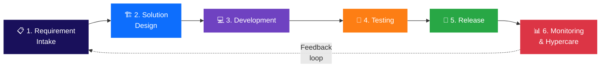

# Delivery Lifecycle Overview

The Software Development Life Cycle (SDLC) defines the end-to-end process our engineering teams use to deliver high-quality, secure, and reliable software. This playbook serves as the foundational governance model, ensuring predictability, visibility, and enterprise-grade quality across all full-stack applications.

## Philosophy and Core Principles

Our delivery process is built upon a foundation of modern, battle-tested engineering practices designed to maximize velocity without sacrificing stability:

- **Agile Delivery & Continuous Iteration**: We embrace iterative development, adapting to customer feedback and business needs through structured agile methodologies.
- **Shift-Left Quality & Security**: We integrate comprehensive testing, threat modeling, and security validation as early as the design and coding phases, preventing downstream bottlenecks.
- **Automation First**: We mandate automated building, testing, and deployment processes (CI/CD) to eliminate human error, ensure consistency, and accelerate time-to-market.
- **Absolute Traceability**: Every line of code deployed to production must be fully traceable back to a specific, approved business requirement, code review, and automated test run.

## Agile Board & Work Management

A well-maintained Agile board (Jira / Azure DevOps) is the *single source of truth* for the engineering team's current status, velocity, and delivery predictability. We maintain strict ticket hygiene, enforce WIP limits, and utilize standard workflow states (from Backlog to Done) to ensure seamless execution.
👉 [View Agile Board Standards](./agile-board-standards.md)

---

## The 6-Phase SDLC Framework

To provide structure without stifling agility, the SDLC is divided into six distinct phases. Every feature, epic, or major component must pass through these phases.

### Phase Entry & Exit Criteria Summary

| Phase | Entry Criteria | Exit Criteria |
|---|---|---|
| 1. Requirement Intake | Business justification approved, Epics created | Backlog prioritised, Acceptance Criteria defined, DoR met |
| 2. Solution Design | Requirements finalized, backlog DoR met | Architecture approved, API contracts defined, Tech risk assessed |
| 3. Development | Design approved, feature branch created | Code reviewed (2+ approvals), unit tests passing, PR merged |
| 4. Testing | Build deployed to test environment | All test types passed, 0 critical defects, DoD met |
| 5. Release | All tests passed, release checklist complete | Tag created, release notes generated, deployment successful |
| 6. Monitoring & Hypercare | Production deployment complete | SLOs met for 2+ weeks, no P1 incidents, hypercare window closed |

---

### 1. Requirement Intake
The bridge between business needs and engineering. In this phase, Product Managers and Tech Leads collaborate to define the *What* and the *Why*, breaking down large epics into actionable, testable User Stories that meet the Definition of Ready (DoR). Our intake process is modularised to cover various scenarios including FRD-provided, discovery-led, and UI-mockup-driven projects.
👉 [View Requirement Intake Details](./requirement-intake.md)

### 2. Solution Design
Before writing code, teams must define the *How*. This phase mitigates technical risks through domain-based Tech Stack Selection, architecture diagrams (C4 Model), API contract definitions, and Threat Modeling to ensure alignment with enterprise standards. It also includes comprehensive comparisons of frameworks, databases, and services to guide architectural decisions.
👉 [View Solution Design Details](./design-phase.md)

### 3. Development
The execution phase where engineers write clean, maintainable code. It emphasises developer ways of working, version control branching strategies, and rigorous peer code reviews. This phase acts as a high-level guide that directly ties into our dedicated Coding Standards as the single source of truth for technical execution.
👉 [View Development Details](./development-phase.md)

### 4. Testing
A comprehensive validation phase spanning unit, integration, end-to-end (E2E), performance, and security testing. This phase champions the "Shift-Left" philosophy across the full stack, ensuring early defect detection. It provides a strategic overview while redirecting engineers to the Coding Standards for exact testing methodologies.
👉 [View Testing Details](./testing-phase.md)

### 5. Release
The controlled process of tagging, packaging, and publishing a production-ready build. This phase covers **automated GitHub release generation**, version tagging, Azure Boards traceability, and automated release-note creation — ensuring every production deployment is fully documented, traceable, and auditable.

> **Note on Deployment Strategies:** Advanced deployment patterns such as Blue/Green, Canary releases, feature flag management, and database migration orchestration are covered in the [Deployment & Operations](../operations/overview.md) section.

👉 [View Release Automation Details](./releases.md)

### 6. Monitoring & Hypercare
Post-deployment operations focusing on full-stack system observability. By utilising tools like Azure Logs, Sentry, and Datadog, teams can proactively monitor application health, track exceptions, control infrastructure costs, and manage incidents efficiently.
👉 [View Monitoring Details](./monitoring-phase.md)
