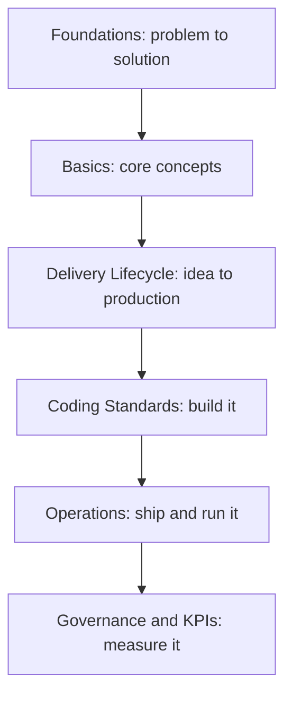

# Getting Started

> **In short**: This playbook is the single source of truth for how our engineering org builds and ships software - from choosing the right solution for a business problem, through coding standards and delivery process, to how we operate and secure what's in production. Use the table below to jump to the section written for your role, or read straight through starting with [Vision & Principles](/vision-principles).

## What is the Full Stack Delivery Playbook?

This is the single reference for how our engineering organization designs, builds, tests, secures, ships, and operates software. It exists so that no two teams have to independently reinvent the same decisions - which database to use, how a PR gets reviewed, what "done" means, how a production incident gets handled. Where a normal onboarding doc tells you *what* to click, this playbook tells you *why* we do things a certain way and *what the rule is* when you're not sure.

It is not a tutorial on programming in general - it assumes you already know how to write code in some language. What it *does* assume you might not know yet is how **our** delivery process, tooling, and standards fit together, which is what the [Basics](/basics/overview) section is for.

## Who is this for?

| You are... | Start here |
|---|---|
| **A client, business stakeholder, BA, or PM** | [Business & Solution Foundations](/business-foundations/overview) - how a problem becomes the right solution |
| **A fresher / new engineer** | [Business & Solution Foundations](/business-foundations/overview) for the "why", then [Basics](/basics/overview), then [Delivery Lifecycle](/delivery-lifecycle/overview) to see how a feature actually moves from idea to production |
| **An experienced engineer new to this org** | [Coding Standards](/coding-standards/overview) for your stack, then [Delivery Lifecycle](/delivery-lifecycle/overview) |
| **A tech lead / architect** | [Architecture Standards](/architecture/standards), [Governance](/governance/overview), [Quality Gates](/quality-gates/overview) |
| **A delivery manager / PM** | [Delivery Lifecycle](/delivery-lifecycle/overview), [KPIs & Metrics](/kpis/engineering-metrics), [Governance](/governance/overview) |
| **On-call / operating a live service** | [Deployment & Operations](/operations/overview), specifically [Incident Management](/operations/incident-management) and [Observability](/operations/observability) |

## How to navigate

The sidebar on the left follows this same order - roughly the order you'd encounter these concerns on a real project:

1. **Business & Solution Foundations** - how a business problem becomes the right solution, before any technology is chosen.
2. **Basics** - foundational concepts (Git, APIs, databases, cloud), written for zero prior context on *this org's* way of working, plus the [Glossary](/basics/glossary).
3. **Project Onboarding** - how to actually create and configure a new project, including tech stack selection.
4. **Delivery Lifecycle** - the end-to-end path a piece of work takes, from requirement intake through development, testing, release, and hypercare.
5. **Development & Coding Standards** - the concrete, stack-specific rules (React, Next.js, NestJS, databases, TypeScript, etc.) you follow while building.
6. **Automation & Integration** and **Data & Analytics** - when and how to automate a process, and how to work with data outside of a single application.
7. **Architecture & Engineering Practices** - cross-cutting structural decisions (monolith vs microservices, sync vs async, build vs buy, ADRs) plus Git branching and environment strategy.
8. **Deployment & Operations** - how code ships (CI/CD, release management) and how we keep it running (observability, logging, incident management, disaster recovery).
9. **Production & Reliability** - availability, performance, scalability, and the SLI/SLO/SLA framework for services already live.
10. **Testing & Security Guardrails** - testing strategy plus what must be true for a system to be considered secure.
11. **Documentation**, **Quality Gates**, **Governance**, **KPIs & Business Value** - how work is documented, measured, and approved at each stage.
12. **Checklists & Templates**, **Case Studies**, **Role-Based Learning Paths** - practical references and worked examples you'll come back to repeatedly.

If you only read one page beyond this one, read [Vision & Principles](/vision-principles) - it explains the "why" behind every rule in this playbook.
