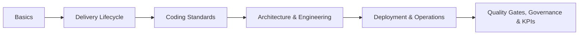

  <h2 class="custom-stats-title">Built for High-Velocity Engineering Teams</h2>
  

    This playbook is not just documentation; it is the absolute source of truth for how we build software at scale. By standardizing our tech stack, automating our quality gates, and embracing AI-driven workflows, we eliminate boilerplate decisions and empower engineers to focus purely on delivering massive business value.
  

  

    

      
100%

      
Compliance

    

    

      
Zero

      
Critical CVEs

    

    

      
Day 1

      
Developer Onboarding

    

  

  <h2 class="custom-stats-title">Not sure where to start?</h2>
  
Find your role below — each one links straight to the part of the playbook built for you.

  

    <a class="role-card" href="/basics/overview">
      
🌱

      
Fresher / New Engineer

      
Start with Basics, then Delivery Lifecycle to see how a feature actually ships.

      
Start with Basics →

    </a>
    <a class="role-card" href="/coding-standards/overview">
      
💼

      
Experienced Engineer, New Org

      
Jump to Coding Standards for your stack, then the Delivery Lifecycle.

      
View Coding Standards →

    </a>
    <a class="role-card" href="/architecture/standards">
      
🏛️

      
Tech Lead / Architect

      
Architecture Standards, Governance, and Quality Gates are built for you.

      
See Architecture →

    </a>
    <a class="role-card" href="/delivery-lifecycle/overview">
      
📋

      
Delivery Manager / PM

      
Delivery Lifecycle, KPIs & Metrics, and Governance track how work moves and is measured.

      
See the Lifecycle →

    </a>
    <a class="role-card" href="/operations/incident-management">
      
🚨

      
On-Call / Operating a Live Service

      
Deployment & Operations covers Observability and Incident Management directly.

      
See Operations →

    </a>
  

  <h2 class="custom-stats-title">Your path through the playbook</h2>
  
The sidebar follows this same order — roughly the sequence you'd hit these concerns on a real project.

  
If you only read one page beyond this one, read <a href="/vision-principles">Vision &amp; Principles</a> — it explains the "why" behind every rule in this playbook.

