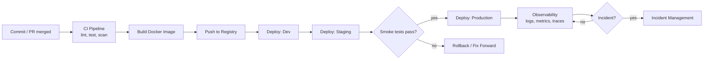

# Deployment & Operations Overview

Shipping code is not the finish line — it's the start of that code's life in production. This section covers everything that happens **after a Pull Request is approved**: how code gets packaged, how it moves through environments, how we watch it once it's live, and how we respond when something breaks.

If you're new to any of the underlying concepts (what a container is, what a pipeline is), read [Basics: Containers & Docker](/basics/docker) and [Basics: CI/CD](/basics/ci-cd) first.

## The path from commit to production

## What's in this section

| Page | Answers the question |
|---|---|
| [Docker](/coding-standards/infrastructure/docker) | How do we package an application so it runs the same everywhere? |
| [CI/CD Pipeline](/coding-standards/ci-cd) | What automated steps run between a merge and a deploy? |
| [Release Management](/operations/release-management) | How do we version releases and roll back safely if something goes wrong? |
| [Observability](/operations/observability) | How do we know what's happening inside a running system? |
| [Logging Standards](/operations/logging-standards) | What exact fields and format must every log line have? |
| [Incident Management](/operations/incident-management) | What do we do when production breaks? |
| [Disaster Recovery & Backups](/operations/disaster-recovery) | How do we recover if the database or infrastructure itself is lost? |
| [DevSecOps Standards](/coding-standards/devsecops-standards) | How is security enforced automatically across this whole path? |

## Environments at a glance

| Environment | Purpose | Who deploys | Data |
|---|---|---|---|
| **Dev** | Integration testing of merged code | Automatic on merge to `develop` | Synthetic/seed data |
| **Staging** | Final pre-production validation, demos | Automatic after Dev passes | Anonymized/prod-like data |
| **Production** | Real users | Automatic after Staging smoke tests pass, or manual approval for high-risk changes | Real data |

**Rule of thumb**: nothing skips an environment. A hotfix still flows Dev → Staging → Production, just faster — see [Release Management](/operations/release-management) for the rollback and 1-click-revert policy that makes this safe to move quickly.
